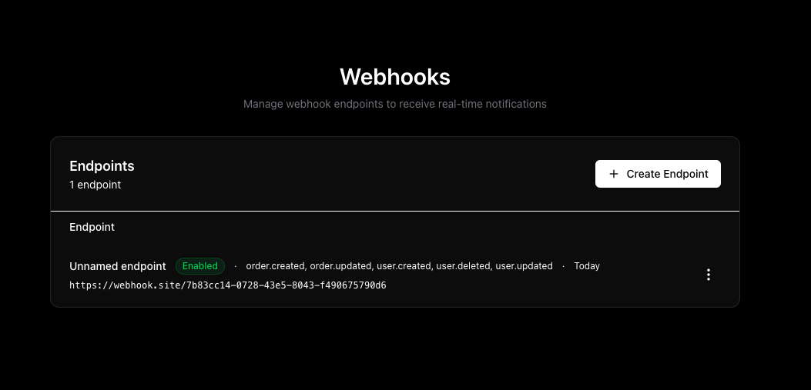
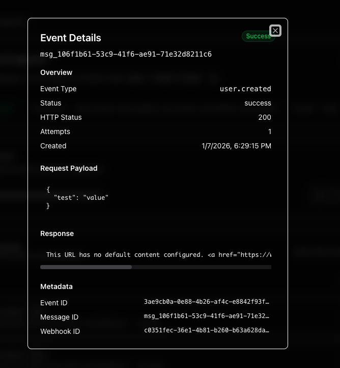
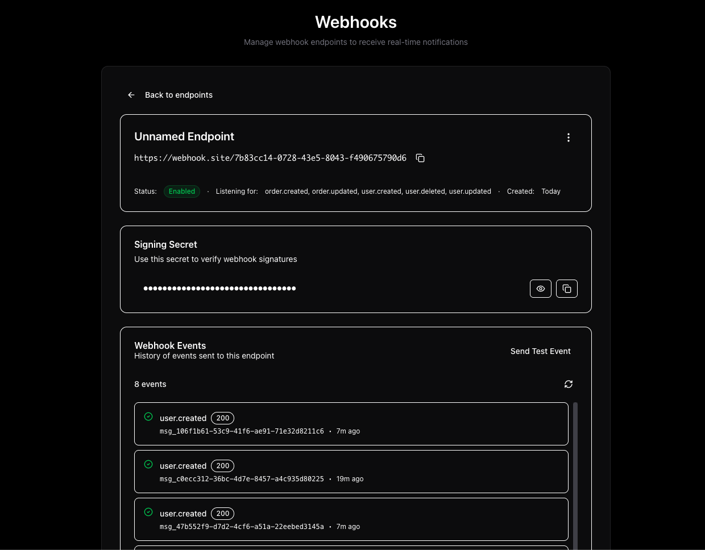

# AWS Serverless Webhooks

Open source serverless webhook-as-a-service built with AWS CDK. Similar to Svix, but self-hosted on your own AWS infrastructure.

## Features

- **API-first design** with OpenAPI specification
- **Type-safe client** generated from OpenAPI schema
- **Durable webhook delivery** using AWS Durable Functions
- **Event-driven architecture** integrated with EventBridge
- **Example configuration UI** included

## How It Works

Deploy the CDK stack to get a complete webhook infrastructure. Emit webhook events either manually through the API client or by creating EventBridge rules that automatically trigger webhooks.

The system uses durable functions to reliably dispatch webhook events with automatic retries and delivery tracking.

## Setup

Deploy the infrastructure:

```bash
pnpm install
pnpm run deploy
```

## Usage

The type-safe OpenAPI client provides methods to manage webhook configurations and dispatch events. See [examples/configuration-ui/src/api/api.ts](examples/configuration-ui/src/api/api.ts) for complete usage examples.

### Using EventBridge

Connect your existing EventBridge events to automatically trigger webhooks. Create rules that route events to the webhook event bus, and the system will dispatch them to all matching webhook endpoints.

## Configuration UI

The included example UI provides a visual interface for managing webhook endpoints and viewing delivery status.







## Architecture

- **API Gateway** - REST API for webhook management
- **DynamoDB** - Webhook configuration and delivery logs
- **Durable Functions** - Durable webhook delivery with retries
- **Lambda** - API handlers and webhook dispatch

## Project Structure

```
packages/
  infra/       - CDK infrastructure definitions
  functions/   - Lambda function handlers
  client/      - Type-safe OpenAPI client
  core/        - Shared business logic
  common/      - Common utilities

examples/
  configuration-ui/ - Example React UI for webhook management
```

## Possible Contribution Topics:
- Add Powertools Idempotency to the durable function delivery step
- The delivery step fails after x retries. It should not fail rather forward the last error to the persistence step.

## Production Setup

The default deployment has no authentication. For production use:

1. **Add an authorizer to API Gateway** - Attach a Lambda authorizer or Cognito user pool to secure the API
2. **Implement multi-tenancy** - Use the JWT token claims to scope webhook configurations per tenant. Pass tenant ID from the authorizer context to Lambda functions to filter DynamoDB queries
3. **Configure rate limiting** - Set up API Gateway throttling and usage plans
4. **Enable monitoring** - Configure CloudWatch alarms for failed deliveries and API errors

## License

MIT
